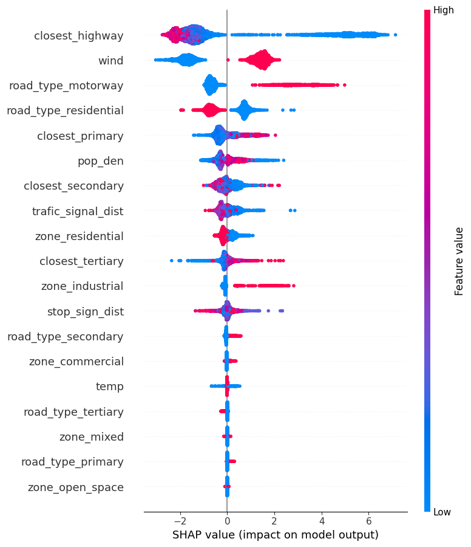

# Geo-Visualization-and-Modeling-in-Air-Quality-Prediction

## Introduction
This project is about applying regression models on a health-related dataset containing air quality in a given coordinate on the map. The main purpose of this project is to 

(1) get familiar with geo-related coding on the map. What is a geopandas dateframe? What is the most commonly used coordiante reference system? How to map the data points on the real map? What are some of the basic geometry type in the GeoDataFrame (POINT, LINESTRING, POLYGON...) and so on so forth.

(2) make full use of the explanatory role of machine learning models. How to interpret given feature importance? Any fancy but meaningful way of describing the feature importance so as to better make data-driven decisions?

## Data and Code
The data and code has been uploaded under this repo.

The basic structure of the data is as follows:
-NO value	
-NO2 value	
-PM2p5 value	
-geometry	
-road_type	
-zone	
-tract_name	
-GEOID	
-state	
-county	
-pop_den	
-wind	
-temp	
-Longitude	
-Latitude	
-Respiratory_HI	
-Pt_CANCR

# Something interesting - SHAP value

## Summary
- Implemented geo-related coding and map visualization with a public health dataset in Oakland to gain data-driven insights about high health risks.
- Performed data cleaning on the GeoDataFrame and grabbed street data before writing a user-defined function to incorporate spatial information.
- Mapped city structure such as different types of roads out and plotted the overall heatmap as regard to hazard air pollution.
- Combined cross-validated bagging and boosting machine learning models (achieved optimal RMSE = 2.16, 5.87 and 1.38), with feature importance, permutation importance and SHAP value to illustrate indicators of NO2, NO and PM2.5 pollution.
