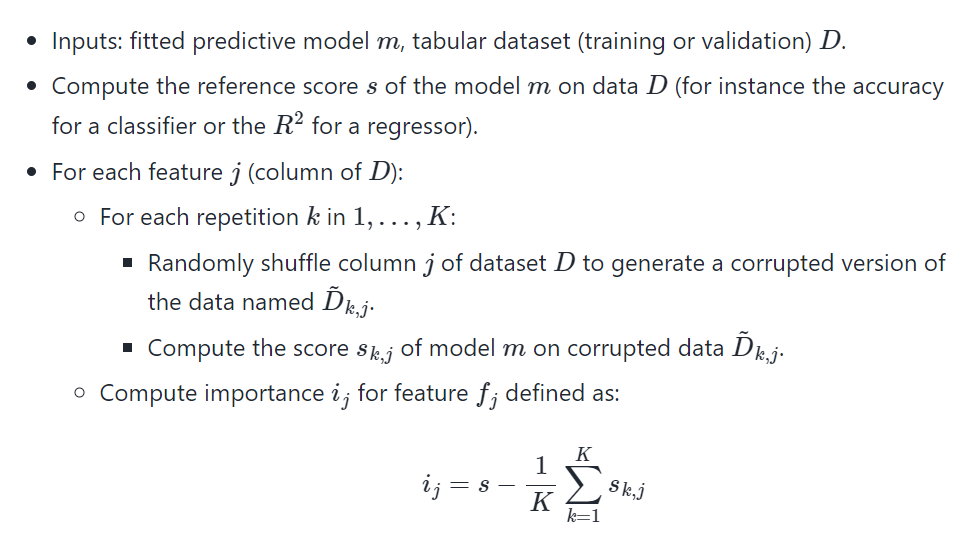

# Geo-Visualization-and-Modeling-in-Air-Quality-Prediction

## Introduction
This project is about applying regression models on a health-related dataset containing air quality in a given coordinate on the map. The main purpose of this project is to 

(1) get familiar with geo-related coding on the map. What is a geopandas dateframe? What is the most commonly used coordiante reference system? How to map the data points on the real map? What are some of the basic geometry type in the GeoDataFrame (POINT, LINESTRING, POLYGON...) and so on so forth.

(2) make full use of the explanatory role of machine learning models. How to interpret given feature importance? Any fancy but meaningful way of describing the feature importance so as to better make data-driven decisions?

## Data and Code
The data and code has been uploaded under this repo.

The basic structure of the data is as follows:
-NO value	
-NO2 value	
-PM2p5 value	
-geometry	
-road_type	
-zone	
-tract_name	
-GEOID	
-state	
-county	
-pop_den	
-wind	
-temp	
-Longitude	
-Latitude	
-Respiratory_HI	
-Pt_CANCR

# Something interesting - SHAP value


More details are be found [here](https://shap.readthedocs.io/en/latest/example_notebooks/overviews/An%20introduction%20to%20explainable%20AI%20with%20Shapley%20values.html).
The summary plot combines feature importance with feature effects. Each point on the summary plot is a Shapley value for a feature and an instance. The position on the y-axis is determined by the feature and on the x-axis by the Shapley value (negative contribution or positive contribution). The color represents the value of the feature from low to high. Overlapping points are jittered in y-axis direction, so we get a sense of the distribution of the Shapley values per feature. The features are ordered according to their importance, the first one being the most important and the last being the least important one.

对于每个预测样本，模型都产生一个预测值，SHAP value就是该样本中每个特征所分配到的数值。假设第i个样本为xi，第i个样本的第j个特征为xi_j，模型对该样本的预测值为yi，整个模型的基线（通常是所有样本的目标变量的均值）为y_base，那么SHAP value服从以下等式：
```
y_{i} = y_{base}+f(x_{i1})+f(x_{i2})+...+f(x_{ik})
```
其中f(x_ij)为x_ij的SHAP值。直观上看，f(xi,1)就是第i个样本中第1个特征对最终预测值yi的贡献值，当f(xi,1)>0，说明该特征提升了预测值，也正向作用；反之，说明该特征使得预测值降低，有反作用。传统的feature importance只告诉哪个特征重要，但我们并不清楚该特征是怎样影响预测结果的。SHAP value最大的优势是SHAP能对于反映出每一个样本中的特征的影响力，而且还表现出影响的正负性。

## About permutation importance


## Summary
- Implemented geo-related coding and map visualization with a public health dataset in Oakland to gain data-driven insights about high health risks.
- Performed data cleaning on the GeoDataFrame and grabbed street data before writing a user-defined function to incorporate spatial information.
- Mapped city structure such as different types of roads out and plotted the overall heatmap as regard to hazard air pollution.
- Combined cross-validated bagging and boosting machine learning models (achieved optimal RMSE = 2.16, 5.87 and 1.38), with feature importance, permutation importance and SHAP value to illustrate indicators of NO2, NO and PM2.5 pollution.
